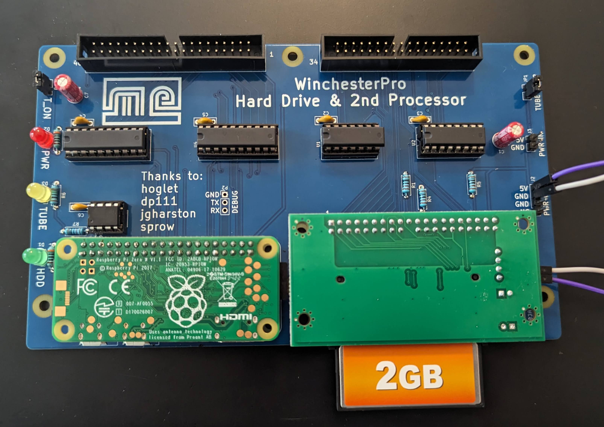

# BBCWinchesterPro

A PCB that combines a Raspberry Pi running [PiTubeDirect](https://github.com/hoglet67/PiTubeDirect) and a J.G Harston's [IDE Interface](https://mdfs.net/Info/Comp/BBC/IDE/), intended to emulate the 6502 2nd Processor and Winchester Hard Disk required to run a Level 3 Econet Fileserver on a BBC Micro Model B.  

The current revision was designed to test if the theory works rather than a finished product. The long term goal is to place it in a suitably 80's looking enclosure which will probably require some changes to the overall size and mounting holes but perhaps in the meantime the schematics and PCB will be useful to someone.

The schematic is included as a [PDF](Schematic.pdf)

## Whats the ATTiny MCU for?

PiTubeDirect *toggles* the Pi's onboard LED when the Tube is accessed, however I'd like an external LED to pulse with activity. The ATTiny detects a rising or falling edge and pulses the LED for 50ms.  

To use this feature you'll need to program the ATTiny and use the [Indigo Alpha 4](https://github.com/hoglet67/PiTubeDirect/releases/tag/indigo-alpha4) revision of PiTubeDirect which supports re-mapping the activity to another GPIO.  

Add the following to the end of `cmdline.txt`: 
`bcm2708.disk_led_gpio=16`

This is somewhat experimental, the code is crude, and I'm not entirely sure if its detecting every edge when the Tube is at full tilt, but it makes the LED blink convincingly   so its good enough for my requirements.  

If you don't want to bother with it, you can bridge pins 2 and 3 of the U5 footprint, indicated on the silkscreen.

## Usage

- For information on setting up and using PiTubeDirect, see the projects detailed [Wiki](https://github.com/hoglet67/PiTubeDirect/wiki)
- To use the IDE interface you'll need version [ADFS  v1.33](https://mdfs.net/System/ROMs/Filing/Disk/Acorn/ADFS133) which has been patched for IDE support.
- I also recommend using patched versions of HDInit and WFSInit that can handle larger discs. 

## Parts Required

- [PCI slot IDE to Compact Flash Adapter](https://www.amazon.co.uk/gp/product/B0913811PP)
- Raspberry Pi + SD Card
- 5x 0.1uF ceramic capacitors with a 5mm pitch 
- 2x 22uF electrolitic capacitors with a 2mm pitch
- 3x 1k 1/4w resistors
- 3x LEDs and suitable 1/4w resistors
- 2x [SN74LVC245AN](http://d.digikey.com/dc/mn-w0iJh4uEE_bUitNCuXpPSTLmwSDrmPaa_ksuLmn07WQWvHI6vieAM8l8Rz71y9-o2iqNxD_lrRHs2f6p78UOWSMZi80Re0OX4QjTHXhzXzyCP1n-WYmlf5x2yjzHYfHzZC5O6tAVstkKuOzoHwbgnRBw45ztk-WaaeLEz83g=/MDI4LVNYSy01MDcAAAGQeWyQoGkputw3nr4VpWGkNsxv4PB3VXIkOks0B2FcjYxorqdoh39jE906jV2IX0SxzNbf8sc=)
- 1x [SN74LS02N](http://d.digikey.com/dc/mn-w0iJh4uEE_bUitNCuXpPSTLmwSDrmPaa_ksuLmn07WQWvHI6vieAM8l8Rz71y9-o2iqNxD_lrRHs2f6p78bnTDQXV0_ONXEKM5iC55d-ZDkkt9n89zQITQIYKv5ImfzPp6AZ2aezEFJFPNdnpA2yuf_bsGcfQkRQfUysnwfE=/MDI4LVNYSy01MDcAAAGQeWyQoGkputw3nr4VpWGkNsxv4PB3VXIkOks0B2FcjYxorqdoh39jE906jV2IX0SxzNbf8sc=)
- 1x [SN74LS139AN](http://d.digikey.com/dc/mn-w0iJh4uEE_bUitNCuXpPSTLmwSDrmPaa_ksuLmn07WQWvHI6vieAM8l8Rz71y9-o2iqNxD_lrRHs2f6p78ZChZSCAtt8kdLK_f7oz0DTUWDhmkEZ-6cGHutOkHit2hcfdb0F0ck6e2jeWpSL4i42dJ505bw-7yi25-H_klbc=/MDI4LVNYSy01MDcAAAGQeWyQoGkputw3nr4VpWGkNsxv4PB3VXIkOks0B2FcjYxorqdoh39jE906jV2IX0SxzNbf8sc=)
- 1x [ATTINY85-20PU](http://d.digikey.com/dc/mn-w0iJh4uEE_bUitNCuXpPSTLmwSDrmPaa_ksuLmn3wb489Ozp7P-auFeMYVOl116EiIEbZ38BDQy1OX_LrrLPV3Ec8LFvckgIt5WBiMOWBzA2AtKbyb9r8UKNGoR5mw2eYflZHiaYFx4eLpeBZ2Q5_0KFzTh_zHWoZHqgDAwE=/MDI4LVNYSy01MDcAAAGQeWyQoGkputw3nr4VpWGkNsxv4PB3VXIkOks0B2FcjYxorqdoh39jE906jV2IX0SxzNbf8sc=)
- 2x 20 pin DIP sockets
- 1x 16 pin DIP socket
- 1x 14 pin DIP socket
- 1x 4 pin DIP socket
- 1x 40 Pin, 2.54 pitch Male Shrouded + Keyed connector
-  1x 34 Pin, 2.54 pitch  Male Shrouded + Keyed connector
- 1x 40 Pin, 2.54 pitch Female connector with key
- 1x 40 Pin, 2.54 pitch  Female connector without key. (Or get 2 of the above)
- 2.54 pitch male header pins - a few 
- 2x Jumpers
- Nylon PCB standoffs - some

## Future improvements
- The Raspberry Pi SD card is blocked by the CF adapter, so upgrading PiTubeDirect requires removing the Pi entirely which isn't great. The Tube and IDE sections of the board should probably be swapped.
- The PCB was designed for a specific IDE to CompactFlash adapter which has resulted in the pin numbering being backwards, making it unsuitable for use with cables or other adapters. In a future revision I'd like to use a standard pin numbering for greater flexibility
- There's no power available on pin 20 of the IDE connector, which some CF adapters can utilise. In future revision it's probably sensible to make power available on this pin with a solder jumper to enable it.

## License

- The PCB is licensed under GPL 3.0
- The [PiTubeDirect](https://github.com/hoglet67/PiTubeDirect) interface schematic and firmware is licensed under GPL 3.0
- The [IDE interface](https://mdfs.net/Info/Comp/BBC/IDE/) was designed by J.G Harston and [sprow](http://www.sprow.co.uk/) and anyone is permitted to use the design with acknowledgement.

